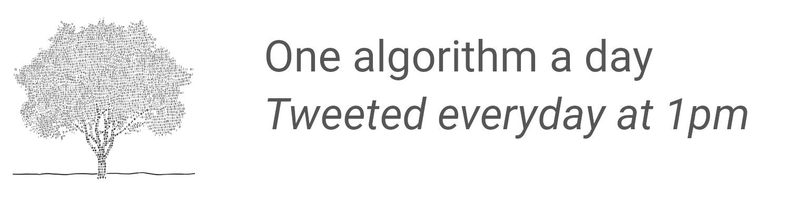

# OneAlgorithmADay

A twitter bot that tweets one algorithm a day, to keep the doctor away ;)

## Algorithms

The full list is available in `algorithms.csv`. They have been scrapped from https://en.wikipedia.org/wiki/List_of_algorithms.

## The bot

The twitter bot is available at https://twitter.com/AlgorithmDay and from my [project's website](https://projects.victormeunier.com/algorithms-twitter-bot/algorithms_twitter_bot.html)

## How to use?

This repo can be reuse as a starting point to make a simple twitter bot. Inside *main.py*, you'll call your scraping or any information calculations, retrieval you want. You'll format the informations to create a tweet, and then use the **Twitter** class to connect and update your status.  

To run, type:

    python main.py

## How to create a Twitter app?

- Head to <https://developer.twitter.com/en/apps> and click 'Create an app'.

*Note: You must be enrolled as a developper to do that*

- Fill in the different fields (app name, descrption, etc...)
- Once you're done, you'll see your app listed. Head to the details and to the 'Keys and tokens' tab.
- Copy the keys to corresponding fields in *twitterBot.py*

*Note: DO NOT SHARE YOUR PRIVATE KEYS!*

- (Optional) Under 'Persmissions', make sure you have read and write if you want to tweet status update

## Requirements

See the *requirements.txt* file or simply run

    pip install -r requirements.txt